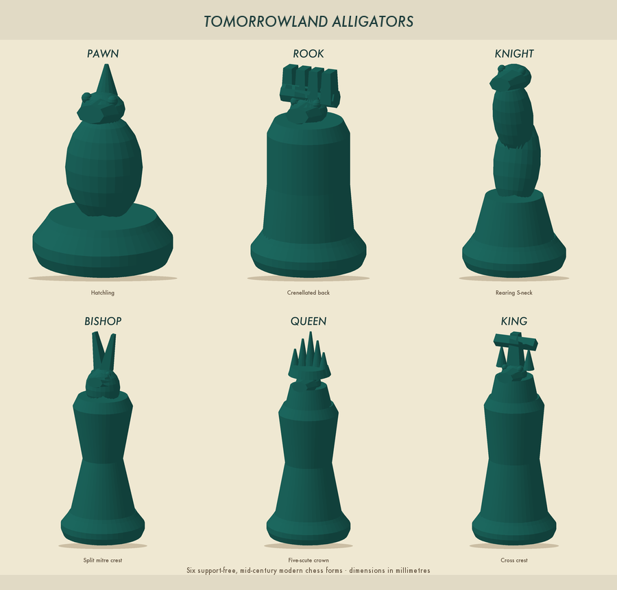

# Tomorrowland Alligators Chess Set

A six-piece chess family built around streamlined alligator forms and 1960s
mid-century Tomorrowland styling. The set is deliberately graphic rather than
anatomical: broad orbital brows and tapered muzzles make every piece read as an
alligator, while the upper silhouette preserves its chess identity.



## Files

| Piece | STL | Size (X × Y × Z) | Design cue |
| --- | --- | --- | --- |
| Pawn | `stl/alligator_pawn.stl` | 26 × 26 × 35.7 mm | Simple hatchling with a single dorsal scute |
| Rook | `stl/alligator_rook.stl` | 30 × 30 × 50 mm | Four blocky back scutes form a crenellated tower |
| Knight | `stl/alligator_knight.stl` | 30 × 30 × 57.6 mm | Rearing S-neck and swept-back mane scutes |
| Bishop | `stl/alligator_bishop.stl` | 29 × 29 × 69.5 mm | Split leaning crest reads as an open mitre |
| Queen | `stl/alligator_queen.stl` | 32 × 32 × 77 mm | Five flowing crown scutes |
| King | `stl/alligator_king.stl` | 33 × 33 × 78.5 mm | Tall supported cross crest |

All dimensions are millimetres. Each STL contains one piece, upright on the
build plate at Z=0.

## Print guidance

These pieces were designed to print upright without supports on a normally
tuned FDM printer.

- Layer height: 0.16–0.24 mm
- Walls: 3 perimeters
- Top/bottom: 4 layers
- Infill: 10–15% gyroid or grid
- Brim: usually unnecessary; use 3–5 mm for the knight if bed adhesion is marginal
- Supports: off
- Scale: 100%; all bases are sized for a conventional tournament-scale board
- Material: PLA recommended; PETG also works with adequate cooling

The snouts have short projections and faceted lower keels. Crown elements are
tapered, the king's crossbar has a self-supporting diamond section, and every
base has a broad flat underside.

The source generator represents each design as overlapping closed solids. PrusaSlicer,
OrcaSlicer, Bambu Studio, Cura, and other current slicers merge these volumes at
slice time. If a slicer offers an option such as “union overlapping volumes” or
“remove mesh intersection,” leave it enabled.

## Verification

`mesh_report.csv` is regenerated with the models. Every constituent shell is
closed, each edge is shared by exactly two triangles, there are no degenerate
triangles, and every model begins at Z=0. Triangle counts and exact bounding-box
dimensions are recorded in that report.

To regenerate the STLs and previews using Python 3 plus Pillow:

```sh
python3 generate_models.py
python3 render_previews.py
```

`generate_models.py` itself uses only the Python standard library; Pillow is
needed only for the preview images.

