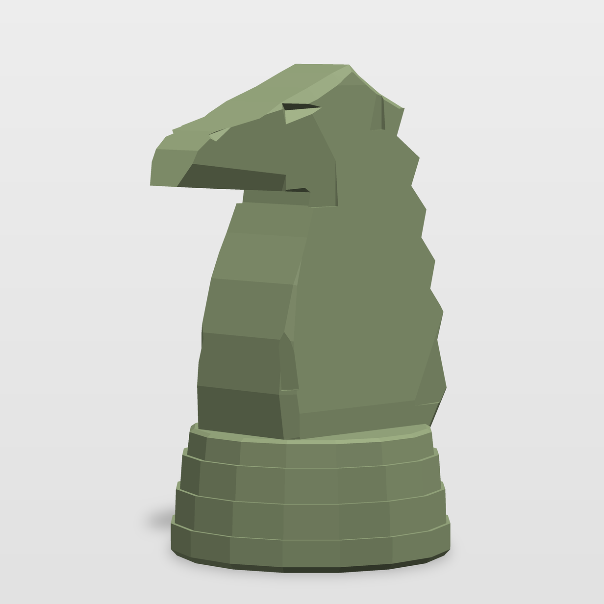

# Baseline knight — the reference form for the set

`stl/knight_baseline.stl` is the piece every other piece in this set will be
built from. It is not a sketch: the plinth, the chamfer language, the
construction method and the printability rules established here are the ones
the pawn, bishop, rook, queen and king inherit. Get this one exactly right and
the rest are head swaps.



## The piece

|                     |                                            |
| ------------------- | ------------------------------------------ |
| Height              | 60.0 mm                                     |
| Plinth              | 34.2 mm across the flats, 16-sided          |
| Volume              | ~28.0 cm³                                   |
| Triangles           | ~1,100                                      |
| Mesh                | watertight, genus 0, consistent winding     |
| Units               | millimetres, Z up, sits on Z = 0            |

Everything is planar. There is not one smoothed surface, one filleted edge or
one tessellated curve in the model — every face is flat and every transition
is a real edge, because that is what the reference is.

## How it is built

Three primitives, in `chesskit.py`:

1. **`chamfered_extrude`** — a closed side-view outline extruded at ONE
   half-width, with a bevel running from the flank to the silhouette edge. One
   width per slab is the whole trick: it guarantees the flank is a single flat
   plane instead of a dome, which is what makes the low-poly read honest. The
   knight is two of these — a narrow head slab unioned onto a wider body slab,
   and the step between them is the jowl.
2. **`polygon_base`** — the stacked 16-gon plinth. Shared, unchanged, by every
   piece in the set.
3. **Boolean cuts** — `slice_block` / `slice_block_z` (flat blocks that shave
   a mass along an exactly planar face: the muzzle taper, the jaw draft, the
   neck and skull drafts, the mane taper), `groove_along` (V-creases: the lip
   line, the chest panel) and `pocket` (the eye).

Taper is never modelled by varying the extrusion width — always by subtracting
a flat block. That is deliberate: varying the width produces a curved flank
and a fan of triangles where the side cap has to close over it. Cutting with a
plane produces a plane.

## Printability

Printed upright on the plinth, no raft needed.

- **The plinth has zero overhang.** It only ever narrows going up; every one
  of its four steps is an upward-facing shelf. The bottom edge is lifted
  0.75 mm so the first layer cannot flare.
- **Bevels sit at 39° from vertical** (`BEVEL_RATIO = 0.80`), inside the
  support-free window for any printer.
- **The mane teeth self-support.** Each tooth's underside runs 28° from
  vertical.
- **The muzzle underside is drafted to 40°** rather than left as a flat
  ceiling — `jaw_draft` narrows the jaw to a 2.8 mm keel, which is also what
  gives the muzzle its triangular horse section rather than a flat bill.

**No layer contains an island.** This is the number that actually decides
whether a print succeeds, and it is checked rather than assumed: `layer_report`
slices the piece at 0.4 mm and walks all 150 layers. Every one is a single
closed loop — the nozzle never starts extruding into air, and the piece grows
continuously from the plate to the crown. Thinnest section 0.69 mm, and that is
the 0.2 mm sliver at the very tip of the crown.

**The one honest caveat**: the knight's muzzle projects ~15 mm forward of the
throat, and that projection grows faster than 45° per layer, so part of its
underside is a steep overhang no matter how the section is drafted. This is
inherent to the shape of a knight, not a modelling shortcut. It measures
**155 mm², 2.3% of the surface**, all of it in the band z = 43–50 mm, all of it
tucked under the jaw where nobody looks. Because it is an overhang on connected
material and not an island, it prints — the surface will show some droop on an
unsupported FDM run.

Recommended: print upright with supports enabled at a 50° threshold and
`everywhere`, not `on build plate only` — the latter will not catch it. The
contact patch is a few mm². On resin, print upright and let the slicer support
the jaw. Alternatively tilt the model 20° nose-up, which brings the whole
underside inside 45° at the cost of supporting the plinth rim.

Run the numbers yourself:

```
python3 -c "import knight, chesskit; m = knight.build(); \
    print(chesskit.printability(m)); print(chesskit.layer_report(m))"
```

## Fidelity to the reference

The target photograph is written down twice: as prose in `REFERENCE.md` and as
numbers in `reference.py` — a 20-row outline table, a landmark list and the
solved camera. `compare.py` renders the STL at that camera, extracts the
silhouette, normalises it against its own bounding box and reports the error
at every row:

```
python3 compare.py
```

It also writes `preview/overlay.png` — the render greyed out with the
reference outline's target points marked in red, so a miss is visible rather
than argued about.

The camera itself was solved, not guessed: the width-to-height ratio of the
outline pins the yaw once the plinth diameter is fixed, and the squash of the
plinth ellipse pins the elevation.

## Files

```
chesskit.py     the geometry kernel — shared by the whole set
knight.py       this piece: outlines, cuts, assembly
reference.py    the photograph as numbers (camera, outline, landmarks)
REFERENCE.md    the photograph as prose
compare.py      render-vs-reference measurement + overlay
render.py       headless software rasteriser (no GPU, no display)
stl/            the deliverable
preview/        renders
```

Rebuild everything:

```
python3 knight.py          # writes stl/knight_baseline.stl + the print report
python3 compare.py         # measures it against the reference
```

Dependencies: `numpy`, `trimesh`, `manifold3d`, `scipy`, `pillow`.
