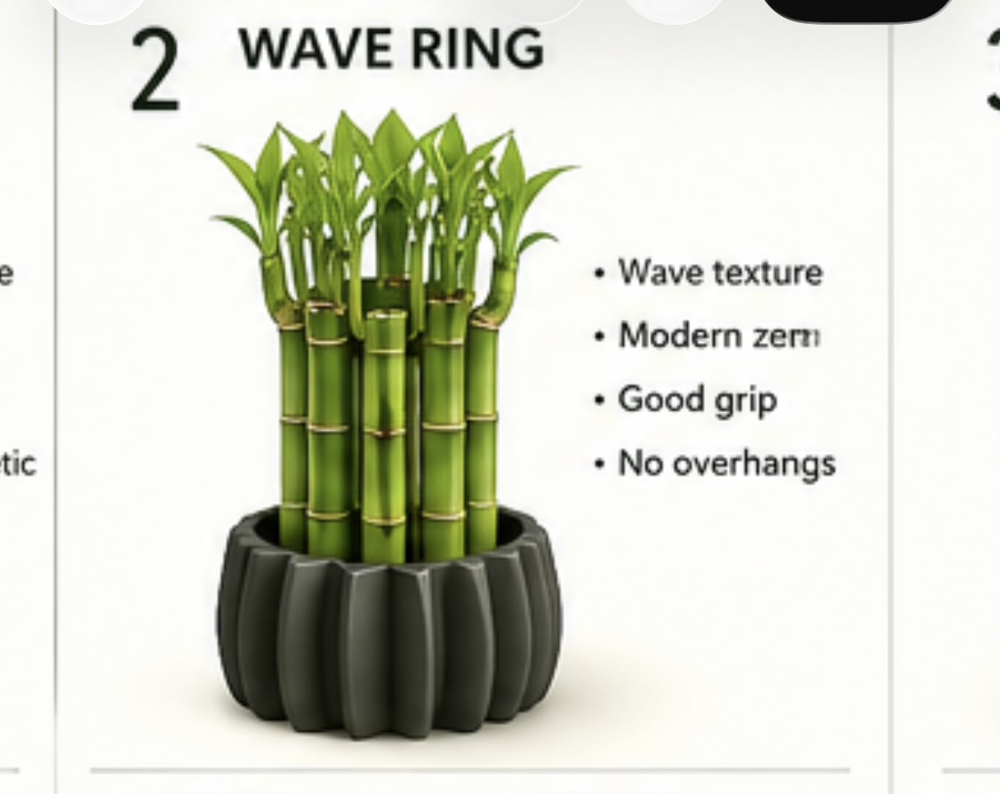

# Bamboo Wave-Ring Vase

A parametric, 3D-printable **"Wave Ring"** vessel for a bunch of lucky (curly)
bamboo — vertically fluted, squat and grounded, sized around your actual plant.
Six ready-to-inspect variants plus an optional centering collar, all generated
by one dependency-free Python script.



## Your measurements (from the photos)

| Thing | Measured | In mm | Notes |
|---|---|---|---|
| Bunch (stalk bundle) | ~3 in across | **76 mm** | drives the interior diameter |
| Plant overall height | ~24 in | **610 mm** | top-heavy, curly stalks + foliage |

The plant is tall and top-heavy, so the design puts **mass and ballast low**
(thick walls + glass beads + water) rather than chasing height. A wide, squat,
heavy base beats a tall narrow one for tip-resistance.

## Design philosophy

- **One gesture.** Continuous vertical flutes wrap the body like an ensō that
  never closes — a single quiet rhythm, nothing else competing. Matte dark
  filament suits it (the reference is a near-black satin).
- **Vertical flutes = zero overhangs.** Printed upright the walls are plumb, so
  there is nothing to support and the ribs give a real, tactile grip.
- **Stability is designed in.** Walls are thick, the floor is solid, and the
  cavity is a plumb cylinder — beads and water sit low and pin the center of
  gravity near the table.
- **Honest interior.** The inside is a smooth straight cylinder so a coat of
  spray rubber goes on clean and even, and beads pour without catching.
- **Proportion over round numbers.** Heights and wave counts step through
  thirds / gentle golden ratios rather than arbitrary values.

## The six variants

Inspect the SVG previews in [`img/previews/`](img/previews) (top view shows
flute count + bead space around the green bunch; side view shows proportions and
the dashed water/bead cavity). STLs are in [`stl/`](stl).

| Variant | Height | Outer ∅ | Waves | Flute depth | Belly | Bead gap* | Well vol** | Character |
|---|---|---|---|---|---|---|---|---|
| **zen-squat** | 95 mm | 128 mm | 12 | 5.0 mm | – | ~18 mm | ~0.9 L | Wide, grounded, deep lobes. Most stable. |
| **zen-classic** | 130 mm | 125 mm | 14 | 4.0 mm | 3 mm | ~14 mm | ~1.1 L | Balanced hero piece, subtle barrel. |
| **zen-tall** | 170 mm | 121 mm | 16 | 3.5 mm | 4 mm | ~12 mm | ~1.3 L | More presence, deepest water well. |
| **fine-flute** | 130 mm | 116 mm | 24 | 2.5 mm | – | ~14 mm | ~1.1 L | Fine modern ribbing, best grip. |
| **bold-wave** | 125 mm | 132 mm | 9 | 6.5 mm | 4 mm | ~14 mm | ~1.0 L | Dramatic pumpkin lobes. |
| **zen-mini** | 90 mm | 109 mm | 12 | 4.0 mm | – | ~10 mm | ~0.6 L | Compact / snug. |

\* radial gap of glass beads around the 76 mm bunch. &nbsp; \*\* full interior
cavity volume; actual water is the bottom ~40–60 mm.

**Where to start:** print **zen-classic** as the hero. If it reads too tall for
the space go **zen-squat**; if you want it taller/heavier go **zen-tall**.
**fine-flute** and **bold-wave** are the two ends of the "how loud is the wave"
dial for comparison.

## The variables you asked about

Everything is parametric in [`generate_bamboo_vase.py`](generate_bamboo_vase.py):

- **Height** (`height`) — the main proportion lever.
- **Number of waves** (`n_waves`) — more = finer, calmer, more grip; fewer =
  bolder, pumpkin-like.
- **Wave "pitch"/depth** (`amp`) — how far the crests stand out from the valleys
  (the flute depth). This is the knob that most changes the character.
- **Belly** (`belly`) — a subtle exterior barrel (0 = perfectly plumb). Kept
  small so it stays support-free (all variants are ≤ ~6° overhang).
- **Interior diameter** (`inner_dia`) — bead space around the bunch.
- **Wall / floor** (`wall`, `floor`) — thickness for water-tightness and mass.

Edit the `VARIANTS` table at the bottom of the script and re-run to make more.

## How the geometry keeps the wall safe

The interior is the honest shape: a plumb cylinder. The exterior is that
cylinder offset outward by the wall, plus the flute:

```
r_out(θ, z) = inner_r + wall + belly(z) + amp · (0.5 + 0.5·cos(n·θ))
```

Using `(0.5 + 0.5·cos)` means flute **valleys are exactly `wall` thick** (never
thinner) and **crests are `wall + amp`** — the wall is thickest where the ribs
are, and there is no paper-thin spot. Flutes run the full height, so the walls
stay plumb and overhang-free.

## Printing

- **Orientation:** upright, as modeled. No supports needed.
- **Material:** PLA or PETG both fine (you're sealing it anyway); PETG is a
  little tougher. Matte dark filament matches the reference best.
- **Walls/perimeters:** ≥ 3 perimeters (the model is 2.8 mm min wall). Do **not**
  print vase/spiralize mode for these — they're designed as solid-walled
  vessels so they're sturdy and easy to seal.
- **Floor:** ≥ 5 solid bottom layers (floor is 4 mm).
- **Infill:** 10–15% is plenty; the walls carry it.
- **Layer height:** 0.2 mm general; 0.12–0.16 mm if you want the flutes crisper.
- All variants fit a 256 mm (Bambu/Prusa/Ender) bed; the widest is 132 mm ∅ and
  tallest 170 mm.

## Waterproofing (your spray-rubber plan)

FDM layer lines always seep, so seal the inside:

1. Print, then let it fully cool and wipe out dust.
2. **Mask the rim and outside** (painter's tape) so the coating stays on the
   interior — the flutes look best bare.
3. Apply **Flex Seal / Plasti Dip / flexible pond-liner spray** in **2–3 light
   coats**, letting each cure per the can. Get the floor, the wall, and up over
   the rim lip.
4. Extra insurance: brush a thin bead of food-safe silicone into the
   floor-to-wall corner before spraying.
5. Cure fully (often 24–48 h) before adding water. Do a **water test in a sink**
   overnight first.

Lucky bamboo only needs ~1–2 in (25–50 mm) of water over the roots, so the
sealed zone really only has to be the lower third — but coating the whole
interior is easiest and safest.

## Glass beads: centering + ballast

The beads do two jobs: **center** the bunch and **weigh the vase down low**.

1. Stand the bunch in the empty vase.
2. Pour **glass beads / pebbles** around it until the bunch is held upright —
   roughly **50–70 mm** deep. This is your main anti-tip ballast; more beads
   lower = more stable.
3. Add water to cover the roots (keep the waterline **below** the bead top so
   the stalks aren't sitting in a full column).
4. Refresh water weekly; distilled/filtered is kind to lucky bamboo.

**Optional centering collar** (`stl/centering-collar-105mm.stl` and `-112mm.stl`,
matching the two interior sizes): a clean top-hat ring with an 82 mm hole. Pour
the beads first, stand the bunch, then slide the collar down over the stalks to
rest on the rim — it pins the bunch dead-center. **Print it flange-side down**
(fully support-free).

### Stability rule of thumb

A 610 mm plant wants a low, heavy anchor. With ~0.5–1 kg of glass beads plus
water in the bottom of any of these vessels, the center of gravity sits within
the base footprint and it won't tip in normal use. If the plant leans a lot to
one side, prefer **zen-squat** (widest base) and load beads generously.

## Generating / customizing

No third-party libraries required.

```bash
cd bamboo-vase
python3 generate_bamboo_vase.py   # writes stl/*.stl
python3 generate_previews.py      # writes img/previews/*.svg
```

Both scripts are pure Python 3. The STL writer emits watertight binary STLs
with outward-facing normals (verified: every edge shared by exactly two
triangles).

## Files

```
bamboo-vase/
├─ generate_bamboo_vase.py   # parametric vase + collar generator
├─ generate_previews.py      # SVG preview generator
├─ stl/                      # 6 vases + 2 collars (binary STL)
├─ img/
│  ├─ ref-wave-ring.jpeg     # the reference "Wave Ring" card
│  ├─ bamboo-height.jpeg     # plant height reference (~24 in)
│  ├─ bunch-depth.jpeg       # bunch diameter reference (~3 in)
│  └─ previews/*.svg         # per-variant top + side previews
└─ README.md
```

## Open questions / easy tweaks

Tell me and I'll regenerate:

- **Printer bed** smaller than 256 mm? I'll cap dimensions.
- Want a **wider, more stable base** (slightly flared foot)? Easy to add within
  overhang limits.
- Prefer **sharper, more triangular flutes** (superellipse) instead of rounded
  sinusoidal ones?
- A **drainage-free double-wall** or a separate **liner cup** instead of spray
  rubber?
- Different **interior diameter** (more/less bead room) or specific target
  **height**.
