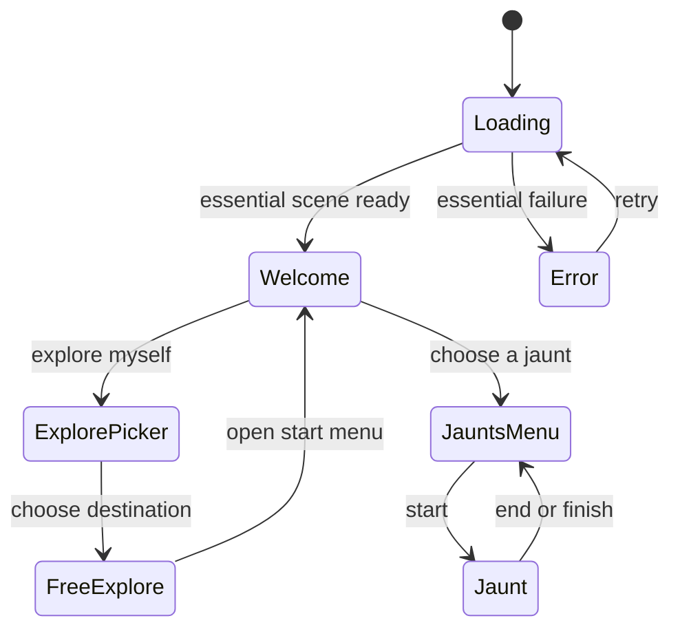

# Arrival, jaunts, and the sources behind Chicago

Owner-directed design, 17 September 2026. This document specifies future work;
the associated ticket filing does not claim that the experience is implemented.
Execution order and requirement coverage: [ARRIVAL-JAUNTS-EXECUTION.md](ARRIVAL-JAUNTS-EXECUTION.md).
Content briefs: [JAUNTS-INITIAL-LIBRARY.md](JAUNTS-INITIAL-LIBRARY.md).

## Decisions

- Welcome copy: **“Welcome to Chicago, summer 1835.”** The owner accepted this
  wording after asking for August. Keep `data/scenes/1835.json.target_date` at
  `1835-07-01`; there is no date-migration ticket. Content still obeys that date.
- The visitor enters a digital reconstruction. The opening explains that in one
  warm sentence, then offers **Jaunts** and **I’ll Explore Myself — Starting At…**.
  The census, completeness percentages and reconstruction statistics belong in
  **Evidence → City** (T-1286) and the source library in **Evidence → Sources**
  (T-1248 + T-1276), reached through the existing Evidence surface — no new tab
  on the narrow mobile rail.
- **Reviewed 2026-09-17 (owner-directed second pass).** Every ticket now names the
  real symbols it extends, the harness ids it must keep, its tests and its
  measurements; the shared contracts below (§A–§H) are the single place a field or
  event name is defined. T-1286 was cut out of T-1276 so the welcome (T-1278) does
  not wait on the whole Sources browser; T-1253 lost its dependency on the welcome
  so the jaunt contract can be written while 5F is in flight.
- Primary jaunt path: about five minutes, normally 4–8 stops. Optional source,
  resident and building cards are outside that timing. Short outings need no
  artificial choices or scoring. No 30–60 minute tour assumptions.
- Extend the existing ES modules, data compiler, travel and cards. No server,
  account, new renderer, duplicated place database or general scripting VM.
- Arrival uses a restrained 1960s time-machine instrument style: dark ink,
  warm ivory, muted brass, tabular digits and a shallow split-flap motion. No
  ornamental gears, compulsory sound, theatrical delay or elaborate machinery.
- Narrative freedom is welcome at its declared tier. This layer does not change
  the research dataset's purpose or its no-human-figures / Indigenous-review rules.

## Repository findings and reuse boundaries

Inspected `dev` at `01ce6b7731d7b9db08a1369f5f9695807b053793`. Reconfirm symbols
when implementing: other reconstruction bands are actively changing the dataset.

| Existing surface | Current behavior | Extension |
|---|---|---|
| `renderers/web/js/main.js`: `progress`, `boot`, `openWorld` | Milestones 8/30/55/68/100; prairie can occupy a long phase; button says Tap to walk; entering requests controls/audio | Structured phase events, ready barrier, presentation controller, separate menu entry from movement capture |
| `renderers/web/index.html`, `css/walk.css`, `css/drawer.css` | Gate already titled Chicago, summer 1835; gate census; drawer becomes mobile sheet | Responsive loader and welcome states; preserve existing design tokens |
| `js/goto.js`: `createGoTo` | Anchors, intersections, structures and located people; shared filters, keyboard, distances | Extract a shared destination model and reuse the picker for free-exploration starting points |
| `js/main.js`: `goToTarget`, `framing` and arrival framing | Person resolves through home/work; arrivals frame a complete building | Single destination/arrival adapter; add located businesses when the authored business layer is available |
| `js/travel.js`: `createTravel`, `PACES`, `paceSpeed`; `js/route.js` | Instantly/walk/wagon/horse/fly; camera intent through walker; route/stall fallback; `setMode` alone does not re-plan a live ride | Cancelable legs, mode switching, shared route-time estimate; retain collision and safe stand-off |
| `js/hud.js`, `js/popup.js`, `js/people.js`, `js/citations.js` | Tabs, cards, source limits, citation links | Jaunt overlay and menu; optional detail navigation with a return token |
| `js/census.js`: `mountGateCensus`; `data/town_census.json` | Counts shown during arrival | Reuse calculations in City summary; keep definitions and denominators |
| `tools/compile_scene.py`: `cite`; source schema and `data/sources/` | 289 registered sources at inspection; joined citation display fields and internal-field partition | Compile a public source-use index, then lazy-load its long lists |
| `data/sidecars/1835/`, newspaper `register_1835.json`, resident index and research ledgers | Entities, per-attribute evidence, dated business assertions | Resolve typed IDs and backlinks at build time; never fetch the private/raw research tree in a visitor session |
| `tools/publish.sh`, `measure_boot_payload.mjs`, `smoke_renderer.mjs` | Generated untracked mirror; measured boot budget; desktop/mobile checks | Publish only compact manifests and content; exercise the published paths |

Related work already owns business authoring/view/staffing (T-1180–T-1190),
resident reconstruction (T-1157–T-1179) and boot-budget CI wiring (T-1156).
These tickets consume their outputs, without reopening those scopes. Existing
arrival framing T-0824 and drawer T-0701 need adapted tests, not a second implementation.

## Arrival states and honest readiness

1. Boot emits `phasestart`, `phaseprogress` where work can be counted,
   `phaseend`, `ready`, and `error` (§A). Use `performance.now()` durations, explicit
   completed units and monotone real progress. Report fetching, terrain/buildings,
   flora, interaction setup and first usable frame separately. Essential readiness
   includes a rendered frame, usable destinations and controls, not a fabricated timer.
2. Animation is presentation over those events. Bounded elapsed-time estimates
   interpolate *within* a live phase; previous local timings may seed weights,
   keyed by content/build signature and detail tier. Clamp stale/outlier history;
   storage refusal falls back to measured defaults. No network telemetry is required.
3. Roll from the current local calendar year (2026 now) toward 1835. Use a continuous
   internal year coordinate with integer display; never roll forward or overshoot.
   Hold at 1836 or above until real readiness. On readiness, finish at exactly 1835
   and atomically show “You have arrived in Chicago, summer 1835.” Settle immediately
   for reduced motion / already-fast boots; a normal cosmetic settle is capped at
   300 ms and never waits for the remaining source cards. The welcome replaces the
   loader as part of that same transition. Year text does not announce every tick.
4. Overrunning phases slow the ticker toward the phase bound rather than lying about
   completion. Rotate phase-appropriate statuses independently; retain a legible
   actual phase label. A suspended tab resumes from current state, not a backlog.
5. A blocked main thread cannot animate. Time-slice expensive CPU loops at safe
   boundaries, yielding to paint; measure long tasks and preserve deterministic
   generated geometry. Do not put Three.js objects in workers merely for this feature.
6. Essential failure stops the ticker and prevents arrival. Explain and allow retry.
   Optional data failure degrades explicitly; it cannot strand free exploration.

## Loading content

Author a versioned JSON library of **160 genuinely varied entries** as an initial
target (acceptable range 100–250). Suggested distribution: assess 30, collect 35,
reconstruct 65, settle/arrive 28, humor 2. Entries carry stable ID, phase eligibility,
weight, template/text, typed entity reference, source IDs, optional fact with locator,
confidence and reasoning, and minimum dwell. Do not multiply verb substitutions
and call that hundreds of facts. At least 50 entries contain distinct supported facts
or entity-specific observations; useful uncited operational messages are also allowed.

Examples, with facts authored from the actual record rather than these sample strings:
“Assessing newspapers… Chicago Democrat”; “Comparing the Wright and Hathaway maps”;
“Reconstructing P. F. W. Peck’s store”; “Laying the riverbank”; “Planting the prairie”;
“Finding your way into town”. The Peck record does **not** supply a certain build
date; never change “reconstructing” into a false claim that it was built in summer 1835.

Use phase-local weighted shuffle bags without immediate repeats, seedable in tests,
fresh per session. Keep source and its fact on the same card and show the source date
when useful (an 1884 account is retrospective evidence about 1835). Bound humor to
at most one line in **1% of sessions**, never during an error or final arrival. One
permitted line is “Reticulating splines”; it is not a cited historical fact.
Normal card dwell is roughly 2–4 seconds; a fast load can display only one or two.
Keep a compact early-boot subset available before the full manifest; no PDF/image
downloads, live newspaper assessment or pretend on-device archival research. One
short line explains that the reconstruction draws on previously researched sources.

## Jaunt content and runtime contract

Proposed authored files: `data/jaunts/<id>.json`, `data/jaunts/schema.json`,
`data/jaunts/catalog.json` (generated light manifest), and compiled per-scene content.
The final published path follows `resolveBases()`; it must work at both `/walk/`
and `/dev/walk/`. Reuse compiler citation shaping; do not ship `data/research/`.

| Field group | Contract |
|---|---|
| Identity | `schema_version`, stable `id`, `content_version`, title, premise, category, scene eligibility, opening, default mode, allowed modes |
| Timing | Primary reading/action estimates and route-derived travel time; displayed duration follows selected mode/settings; optional deep reading excluded |
| Stops | Stable stop ID, typed destination (`structure`, `anchor`, `intersection`, `business`, `person`), 25–60 primary words, 0–3 meaningful choices, card links, next edges |
| Evidence | Claim-level `confidence`, `sources`, locator, reasoning / liberty reference; scene date and `review_required`; authorial connective text explicitly reconstructed |
| State | Optional typed and bounded resources; inventory item IDs; effects restricted to add/remove/set/increment; integer cents for fictional money |
| Branches | Declarative all/any/not conditions and comparisons; named ending IDs; no eval, executable expressions, arbitrary HTML or per-jaunt callbacks |
| Outcomes | Short ending, named era-themed keepsake/achievement, explicit completion eligibility; no mandatory global score |
| Detail | Existing building/person/business/source IDs; no second copy of their biographies or citation records |

Validate schema and semantic relationships at build time: unique IDs, all references,
scene eligibility, evidence/rights/review gates, reachable endings, no accidental cycles,
valid resource domains, at least one viable choice/default continuation at every reachable
state, every branch completable. A historical location with uncertain coordinates remains
uncertain: choose a supported street/anchor stand-off or declare it unavailable, never
invent a precise front door. Unavailable jaunts get a clear menu reason while others work.

Components, as the tickets name them: `boot-phases.js` + `boot-weights.js` (T-1246),
`arrival.js` (T-1247), `loading-content.js` + `loading-early.js` (T-1275),
`destinations.js` (T-1277), `sources.js` (T-1276), `jaunts.js` (T-1279 reducer),
`jaunt-panel.js` (T-1279), `travel-estimate.js` (T-1280), `jaunt-journal.js` (T-1258),
`jaunt-menu.js` (T-1259), and `css/jaunt.css`. Everything after the arrival loads lazily
on first use; only `boot-phases.js`, `arrival.js` and `loading-early.js` join the boot
payload. `main.js` is extended at `progress()`, `openWorld()` and `goToTarget()`; it is
not reorganised.

Runtime state is `menu → opening → travelling → atStop → outcome → menu`, with
optional detail/pause states. `End Jaunt` cancels the active leg and returns immediately
to the Jaunts Menu; no confirmation and no forced ending card. Completion can show a
short outcome inside the returned menu. **Previous Stop / Next Stop / End Jaunt /
Jaunts Menu** remain available in a compact persistent control. First stop disables
Previous; Next requires the current short interaction or an explicit skip, not reading
every history card. At the last stop it completes the jaunt. Menu access pauses and
cancels movement, offers Resume/Restart; selecting a different jaunt replaces the
session cleanly. End clears it. Focus returns to the correct menu card.
Starting a jaunt places the visitor safely at its first stop immediately; do not add
an unpriced journey from wherever the previous outing ended. The displayed primary
duration starts there and includes the opening. Selecting Explore Myself also cancels
and clears any paused jaunt before moving to the chosen free-exploration start.

Use stable event IDs and replayable state. Previous visits the prior visited stop and
retains committed decisions without re-awarding or re-spending. Going forward over
visited stops does not reapply effects. Changing an earlier decision is an explicit
“Revise choice” operation that truncates later events and recomputes the branch.
Canceled or stale arrival callbacks cannot advance a new jaunt (session/leg token).

## Travel and the five-minute path

- Store a recommendation per jaunt, with a changeable selector both on its menu card
  and during play: Walk, Wagon, Horse, Fly, Instantly. Flying is a viewing convenience,
  not an 1835 action. It earns the same story outcomes and no historical travel claim.
- Estimate using the **same** route, pace settings and flight ascent/descent behavior
  used by `travel.js`, plus primary reading/action time. Route length, not a straight
  line across the river, prices ground travel. Mark estimates approximate; no route
  yields a stated fallback, not `NaN` or an invented five-minute label.
- Switching mode cancels and replans from the current position to the current target,
  retaining stop, inventory and choices. It must actually change the moving controller,
  not merely `setMode`'s label. Scene safety, walker intent ownership and full framing
  remain intact. Manual movement pauses auto travel and preserves the jaunt.
- Offer **Go straight to next stop** throughout a leg, including a stalled/replanned
  ride. It uses existing safe instant arrival and earns no duplicate actions.
- Optional one- or two-sentence between-stop context is route-aware, dismissible,
  nonblocking, and accessible later. Never add delay so all narration can be read.
- Author normal recommended-mode runs for approximately 4–6 minutes; legitimate
  very short outings can be 3–4. Example design budget: opening 15 s, six stops at
  25 s, five legs at 20 s, ending 15 s = 280 s. Measure actual paths before claiming
  that an individual jaunt meets this budget. Faster modes update the estimate.
- Separate story time (only explicit choices advance it) from wall time. Opening
  historical cards or reading slowly never penalizes health, money or an ending.

## Collections without turning every outing into a competition

Design inspiration, not dependencies or copied presentation:
[Animal Crossing's everyday activities and collections](https://animalcrossing.nintendo.com/)
suggest low-pressure keepsakes; [Adventure Lab's waypoint stories](https://adventure.geocaching.com/)
suggest brief place-linked interactions; [ink's authorable branching narrative](https://www.inklestudios.com/ink/)
supports separating content/state from rendering. Ink is capable middleware, but a
small JSON vocabulary better fits this bounded engine and existing validation stack.
These are design inferences from the cited primary product descriptions.

Use a visitor's **Chicago daybook** with five optional collection families:
Provisions (receipts/supply lists), Livelihood (work chits), Wayfinding (route notes),
News & Knowledge (clippings/notices), and Neighbors (calling cards/introduction notes).
Give each jaunt one primary family and at most one secondary. A quiet outing can
simply leave a memento. Fictional chits and awards are marked narrative reconstructions;
they never become evidence or biography facts.

Suggested ranks: New Arrival → Finding Your Feet → Knows the Town → Seasoned Chicagoan.
Data-defined thresholds require distinct completed jaunts across all five families
(initial proposal: one, two and three distinct keepsakes in each family); replaying a
single errand cannot farm them. No unlock gates on jaunts, streaks, countdown pressure
or leaderboard. Optional per-jaunt money/readiness/cargo/etc. stay local to that jaunt.
Versioned local storage persists only journal/preferences and a compatible resume state;
blocked storage works in memory, corrupt/old saves recover with an explanation, and reset
is available. All content remains available to a visitor who disables persistence.

## Sources & City

Under the existing Evidence entry, expose Sources and City Summary as shallow views.
Avoid adding enough top-level tabs to overflow the existing narrow mobile rail.
Generate a canonical source catalog plus **typed source-to-claim-to-entity edges**.
Edges include entity type/ID, field/claim pointer, confidence, locator and whether the
use reaches this scene, another scene, an exclusion or a research decision. Source
metadata alone is not evidence that the source contributed to a visible structure.

Default to sources actually used by the selected reconstruction; a clearly labeled
All registered sources filter includes unused/other-scene records with their status.
Offer title/author search and type, date, source-tier and use filters; group newspaper
issues under publication with expandable issue-level locators. Paginate/window long
lists and lazy-load usage details. Show the source's supplies/limits and available
original/archive links. A unavailable archive link has an honest label, not a dead
button. Respect the compiler's public/internal-field partition and asset rights.

“Used for” opens linked places/people/businesses, terrain/flora/fauna, jaunt facts,
or an honest decision summary when there is no scene card. City counts reuse current
census/coverage calculations with their denominators and last build date. Per-source
counts show *unique entities* and *attribute claims* separately; mixed-tier entities
can occupy multiple confidence buckets, so those buckets are not a pie chart or a
sum-to-total assertion. Distinguish source tier 1–6 from claim confidence. Preserve
existing [DOC]/[INF]/[CONJ] display aliases where encountered while storing canonical
`attested`/`inferred`/`reconstructed` values. Never rename the project schema back.

## Mobile and input contract

Loading settles automatically into the welcome/menu surface at readiness. “Tap to
enter” (or “Enter Chicago” on desktop) is the entry gesture where one is needed;
neither it nor a menu click grabs pointer lock. Starting a jaunt or selecting a free
start is also an entry gesture. Audio unlock remains gesture-bound. Movement capture
occurs only when the user enters world controls, after menus close. First-run help
is available in context without hiding the requested welcome or jaunt navigation.

Verify 390×780 and 1280×800 as release gates; also inspect 320 px wide, short landscape,
safe areas and the on-screen keyboard. Use scrollable content and a sticky two-row
jaunt control, >=44 px touch targets, visible focus, logical tab order, focus restoration,
no overlapping popup/drawer/control areas. Respect reduced motion, disabled audio,
keyboard-only input, screen-reader names and polite phase announcements. Detail cards
must return to the same stop/scroll state; no source/jaunt download may block basic entry.

## Completion and execution discipline

Implementers claim the ticket through the remote lock, follow its predecessors, and
ship its visible slice through a green PR into `dev`. The owner explicitly requested
this planning pass; it has no visitor-facing changelog. Runtime changes do.

Finish the small acceptance contract inside one run. Missing numeric precision is
handled at the honest reconstructed tier with a liberty, not a speculative new epic.
If a genuine remaining piece cannot fit, insert one focused successor **inside this
band beside its dependency**, updating the execution matrix. Do not append it to the
queue tail or close an incomplete parent. Keep subsections below 15 tickets. Shared
engine/compiler contracts land before independent content batches; content authors
touch only their jaunt files/dossiers and required generated outputs.

Each implementation ticket owns focused tests; the last two tickets integrate and
measure the experience, rather than being the first place defects are tested. Keep
the existing boot/frame budgets, historical constraints, zero-page-error requirement,
generated-mirror discipline and preflight/merge gates. A later fiftieth jaunt must need
content plus catalog regeneration only, demonstrated by the acceptance fixture.

## Shared contracts — the one place each name is defined

Tickets cite these sections; an implementer who changes a name here changes it in the
ticket that owns it in the same PR.

### A. Boot phases and readiness

`api.boot` (T-1246): `phases[]` in this order — `scene`, `terrain`, `buildings`, `ground`,
`flora`, `people` (optional), `census` (optional), `interaction` — each
`{ id, label, essential, startedAt, endedAt, units, unitsDone, error }`, and
`on('phasestart' | 'phaseprogress' | 'phaseend' | 'ready' | 'error', fn)`. `ready` fires
after the last essential phase and the first rendered frame; `api.ready` keeps its meaning
(the smoke and `measure_boot_payload.mjs` wait on it). `boot-weights.js` holds measured
seconds per phase for `{desktop, mobile} × {full, balanced, light}`, cold and warm, dated;
local refinement lives at `localStorage['c4d.boot.timings.v1']` keyed by build stamp and
tier, clamped to 0.25×–4× of the table.

**Pacing (T-1247):** `p` = Σ finished weights + current phase fraction (counted units, else
elapsed / expected clamped to 0.92 of the phase); `year = now − (now − 1836) · easeInOut(p)`;
integer display; hold ≥ 1836 until `ready`; settle to 1835 in ≤ 300 ms (0 under reduced
motion or a < 1.5 s boot). Arrival line: **"You have arrived in Chicago, summer 1835."**

### B. Loading content entries

`data/loading/statuses.json` (T-1275): `{ schema_version, entries: [{ id, phase:
assess | collect | prepare | resolve | land, kind: source | build | fact | operational | humor,
text, source_ids?, entity?: { type, id }, fact?: { locator, confidence, reasoning },
weight, min_dwell_ms }] }`. Phase arc → boot phases: assess→`scene`; collect→`terrain`,
`buildings`; prepare→`ground`, `flora`; resolve→`people`, `interaction`; land→`ready`.
Humor ≤ 1 % of sessions, never at `land` or on error. Early subset inlined in
`loading-early.js`; the full file is fetched in parallel and never awaited for `ready`.

### C. Jaunt JSON contract

`data/jaunts/<id>.json` validated by `data/jaunts/schema.json` and `tools/compile_jaunts.py`
(T-1253), compiled to `data/sidecars/1835/jaunts/catalog.json` (summary) and
`data/sidecars/1835/jaunts/<id>.json` (content). Top level: `schema_version`, `id`,
`content_version`, `title`, `premise`, `category`, `scene` (`1835`), `featured?`,
`opening { text, read_s }`, `default_mode`, `allowed_modes[]`, `variables? { name: { min, max,
initial, unit } }` (money in integer cents), `inventory? { capacity? }`, `stops[]`, `legs?[]`,
`endings[]`, `keepsake { family, id, title, text }`, `secondary_family?`, `evidence[]`,
`review_required`, `liberties[]`.

`stops[]`: `{ id, destination: { kind: structure | anchor | intersection | business | person,
id }, text (25–60 words), read_s, choices?[0–3] { id, label, consequence, when?, effects?,
next? }, links?[] { kind: structure | person | business | source | topic, id, label },
next? }`. `legs[]` (optional, by index): `{ note?, story? }` — otherwise T-1257 generates a
pass-by note from the route. `when`: `{ all: [...] } | { any: [...] } | { not: ... } |
{ var, op: < <= == >= > !=, value } | { has: item }`. `effects[]`: `{ op: add | remove |
set | inc, var | item, value }`. `endings[]`: `{ id, when?, text, default? }`. `evidence[]`:
`{ text, confidence: attested | inferred | reconstructed, sources[], locator?, reasoning?,
liberty? }` — a `reconstructed` sentence never cites as if attested; a quotation is never
attributed to a named person. No `eval`, no HTML, no per-jaunt code.

### D. Source-use index

`tools/compile_source_use.py` (T-1248) → `data/sidecars/1835/sources/index.json`
(rows: public citation fields, `type`, `date`, `tier`, `use: scene | other_scene |
exclusion | research | unused`, `counts { entities, claims }`, `has_archive_link`) and
`sources/<source_id>.json` (edges `{ source_id, entity_type, entity_id, claim, confidence,
locator, use }`). Entity types: `structure, person, household, business, terrain, flora,
fauna, exclusion, liberty, decision, loading_fact, jaunt`. Fetched only when Evidence →
Sources opens.

### E. Destination model

`destinations.js` (T-1277): `createDestinations({ scene, index, registry, people,
positionOf, businesses = null })` → `{ targets, kinds, search(q, { kind,
includeReconstructed }), byId(kind, id), resolve(target) → { kind, id, label, e, n,
standOff, limit } | null }`. Kinds: `anchor, intersection, structure, business, person`.
`business` reads the authored layer when present, else derives one row per trade-function
structure (`derived_from: 'structure'`). Unlocated rows open their card and never gain
coordinates.

### F. Harness contract — ids and signals the gate reads

Keep: `#gate` (the loader/welcome dialog; `hidden` once the world is entered),
`#gate-btn` (enters free exploration at the spawn — "Enter Chicago"), `#gate-sub`
(the live phase/arrival line), `#gate-bar`, `#gate-build`, `#control-help` /
`#control-help-gotit`, `window.__chicago4d.ready`. New: `#arrival-year`, `#arrival-card`,
`api.boot`, `api.welcome { state, enter(kind, id) }`, `api.destinations`, `api.jaunts
{ start, state, next, prev, end, menu, catalog }`, `api.daybook`. The smoke's `enterTown()`
prefers `api.welcome.enter('spawn')` and falls back to `#gate-btn` (T-1278). The part-1
gate-census assertions move to the Evidence part with T-1286. Budgets: boot payload
12 MB (`measure_boot_payload.mjs --check`), smoke per-leg 30 min (`smoke_budget.mjs
--legs`), both gate viewports 390×780 and 1280×800.

### G. Daybook

`data/jaunts/daybook.json` (T-1258): families `provisions, livelihood, wayfinding, news,
neighbors`; ranks `new_arrival → finding_your_feet → knows_the_town → seasoned_chicagoan`
at `[0, 1, 2, 3]` distinct keepsakes in every family. Storage
`localStorage['c4d.daybook.v1']` = `{ schema_version, content_version, keepsakes[] }`;
session resume `localStorage['c4d.jaunt.session.v1']` = `{ content_version, jaunt,
events[] }` (T-1256). Awards are idempotent per `jaunt + keepsake`.

### H. Travel estimate

`travel-estimate.js` (T-1280): ground `route.length_m / paceSpeed(mode, settings)`; fly =
ascent + cruise + descent with `PACES.fly.cruise(d)`; instantly = framing settle;
unroutable → straight line × 1.3, `approx: true`; no positions → `null` ("no estimate").
`estimateJaunt = opening.read_s + Σ stops.read_s + Σ legs`; displayed as "about N min",
nearest half-minute. A mode change mid-leg stops and re-plans from the current position
with the same target and session.
