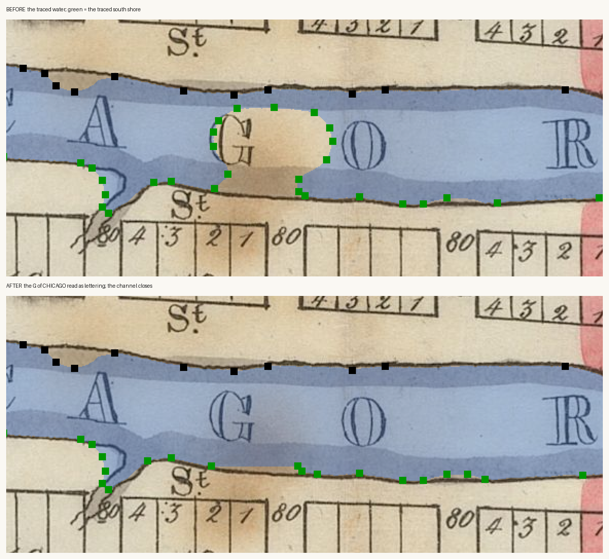
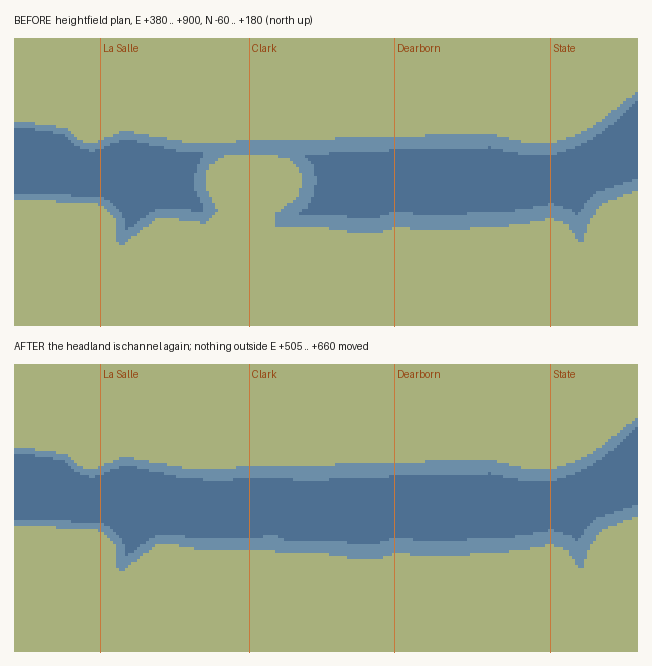

# The bulge in the river at Clark Street — what it was, and what it was not

**Investigated:** 2026-08-13 · **Epoch:** `e1834_harbor_cut` · **Reach:** local E +537 … +619,
N +21 … +82 · **Sheet:** `wright_1834` (BPL master scan, IIIF region 1878,1160,1802,1500) ·
**Tool:** `tools/trace_shoreline.py` · **Roadmap:** K6

The owner reported a large rounded peninsula of land bulging into the main stem at Clark
Street and said it contradicts the record. It does. This memo records what the defect
actually was, the reading that was proposed and ruled out, and what changed.

## 1. The defect, measured

The committed south-shore run left the bank line it had been following at **E +596** and
looped **north to N +82.3 at E +579**, returning to the bank at **E +537**. Either side of
that excursion the same run sits at **N +16 … +26** — so the trace put a 60 m headland into a
75 m channel and left about **12 m of water** between its tip and the north bank at N +94.5.

The same error is measurable from the other end, and had already been measured without being
recognised. `docs/RESEARCH/chicago_american_office.md` § 3 records that the traced 1834 south
bank runs **18.7 m** north of that record's north face at Dearborn and **79.6 m** north of the
equivalent face at Clark — *"the Dearborn end of South Water is georeferenced better than the
Clark end"*. A 60 m swing over four blocks was read as local paper stretch plus the modern
dock line. It was not: it is this loop, and the two numbers are the same defect seen from the
map and from the street.

## 2. What Wright draws there

A clean, near-parallel channel. Both banks are drawn as continuous pen lines with a grey wash
band on their water side, and nothing whatever intrudes into the reach between E +530 and
E +630. There is no ink line anywhere around the traced headland.

## 3. What the trace was actually reading

Wright letters **CHICAGO RIVER** in outline display capitals straight across the main stem.
The inside of an outline capital is unwashed paper, so every one of those letters comes out of
the wash segmentation as dry ground standing in the channel. That is already handled for the
letters that fall wholly inside the water: each becomes a *hole* in the water body, and the
tool's `island_min_px` rule fills it back in — the run has always reported *"2 filled as
lettering"* for exactly this reason.

The **G** of CHICAGO is the one that does not. A brown foxing stain runs south from it to the
drawn bank, so the letter, the stain and the south bank were **one connected dry region** —
never a hole, never filled, and the boundary walk went round all three.

The figure is the tool's own `--debug` overlay at this reach: blue is the traced water, green
the traced south shore, black the north shore. In the upper panel the traced shore is wrapped
round the letter G. The letters A, O and R beside it are inside the water in both panels,
which is what the island rule is doing. (Derived from `wright_1834`; `rights_status:
no_known_restrictions`.)

## 4. The reading that was proposed, and why it is not this

The owner's crop of the sheet
(`data/sources/assets/prefire_views_kevin_2026_08/wright1834_clark_reach_crop.jpeg`) shows a
narrow sinuous line dropping south off the bank between blocks **19** and **18**, drawn in the
same thin ink as the river's own banks, with the platted 80 ft street respecting it. The
proposal was that the bulge is that stream — either closed across its mouth so the ground
between it and the river was classified as land, or traced so wide that the land beside it was
drowned.

**The stream is real, it is already traced, and it is not the bulge.**

| feature | local E | local N |
|---|---|---|
| the drawn watercourse's mouth | **+462 … +469** | +5 … +33 |
| the traced south shore's excursion into it | +467.2, +463.0, +465.0, +462.8, +455.8 | +5.3 … +37.0 |
| the bulge | **+537 … +619** | +21 … +82 |

Seventy to a hundred and fifty metres apart, and the segmentation confirms it directly: the
dry region the trace walked round occupies map pixels x 321–436 in the working window, where
the stream mouth is at x ≈ 2093–2100 resource / x ≈ 215 window — a different feature, about
100 map pixels (≈ 72 m) west. The `--debug` overlay at 7× shows the traced water running **up
the inside of the stream's own ink line** on both sides: the mouth is neither bridged nor
widened. What Wright draws stops at the street line, and the trace stops there with it.

Two further notes on the streams, neither of which this parcel acts on:

- The dossier's one named South Division watercourse — `docs/research/01-terrain-hydrology.md`
  zone 14, *"the slough … entered the river at the end of State Street"* — is at E ≈ +827, and
  the traced south shore does carry a southward re-entrant at E +850 … +856, N +8 … +21. That
  is a separate feature from this one and is consistent with the dossier.
- The E +465 re-entrant is at La Salle Street (platted centreline E +452). The dossier records
  that the 1830 Thompson plat shows **three sloughs off the Main Branch**; this is plausibly
  one of them, and Conley/Stelzer 1833 is the designated primary guide for where the streams
  come in and where they terminate (ROADMAP § S2e). Carrying it further south than Wright
  washes it would be inventing a bank where the draughtsman stopped, which is the one thing
  `trace_shoreline.py` is explicitly built to refuse. **Left as a research thread**, in the
  form the north-side slough already takes: a `hydrology.geojson` centreline, argued from
  Conley/Stelzer with Wright as the check, not a boundary traced from a wash that is not there.

## 5. What changed

`tools/trace_shoreline.py` gained a declared **`LETTERING`** window, in resource pixels like
its existing seeds and anchors, covering the G and the stain (E +530 … +628, N +20 … +87).
Inside it a dry span with **channel at both ends of its own row** is read as a gap in the
*drawing*: the river runs west–east across this window, so "water to my left and water to my
right" is what a reader uses to see through the type, and the rule cannot walk past a bank
because a row south of the bank line has no water on its landward side to bracket it. The
waterline inside the box is still Wright's own wash, reconnected across his own type; no new
line is drawn. The box must recover pixels or the run dies, so the constant cannot rot
silently. **7 606 px (3 850 m²)** were recovered.

The corrected walk is **spliced into the uncorrected one at the box**. Douglas–Peucker halves a
ring by index, so simply republishing the corrected ring moved vertices a kilometre away —
measured on the heightfield, 5 037 cells by up to 0.30 m, with 49 of them crossing the
waterline, all of them hundreds of metres from the defect. The splice makes the declared box
the blast radius by construction.

## 6. The two proofs

**Thirteen vertices removed, three added, nothing else touched.** The `north_shore_harbor_reach`
run and the `sand_bar_1834` ring are byte-identical. Every vertex outside E +536.9 … +619.1 is
byte-identical.

**Heightfield, 809 × 321 = 259 689 cells, regenerated by `generators/terrain_gen.py`:**

| | inside the corridor E +505 … +660 | outside it |
|---|---|---|
| cells whose int16 sample changed | 1 719 of 20 223 | **0 of 239 466** |
| max abs delta | 3.605 m | **0.000000 m** |
| cells crossing the waterline (z < 0) | 620, all land → water | **0** |

The corridor is wider than the corrected reach because the generator derives elevation from
distance to the waterline, so moving the bank re-solves the ground behind it: 547 cells that
are land before and after still shift, by at most 0.495 m, dying out by N −200.

The plan is the committed heightfield itself, land against water, north up, with the platted
street centrelines drawn for position. The two small southward re-entrants — La Salle and
State — are the drawn watercourses of § 4, and they are pixel-identical in both panels.

**Gradient audit unchanged and passing**: `plain_block_max` 0.468 ft per 300 ft (rule: under
0.5), mean 0.1281, over 119 470 audited plain cells. `min_m`, `max_m` and the whole
`relief_ft` block are identical. Water coverage 25.09 % → 25.33 %.

**Structure ground contact unchanged**: `tools/validate.py` reports the same 8 structures not
reaching the terrain under them, all 8 declaring it, and the smoke's per-structure anchor
check is green.

## 7. The render, from the owner's own viewpoint

`after_k6_clark_reach_2026-08-13.png` — local E +706, N +102, bearing 240°, 18 m up, which
is approximately where `p8_1.png` was taken. The Dearborn Street drawbridge is at the lower
left for scale; the reach runs clean past Clark where the screenshot had a headland filling
the middle of the frame.

`after_k11_gallery_waterline_2026-08-13.png` is the K11 companion (E +95, N −152, bearing
337°, 13 m up ≈ `p9_0.png`): the gallery timber stands along both banks and nothing stands
in the channel.

## 8. The same family, on the South Branch — and why the repair is not shared

`south_branch_spike_1834.md` measures the same fault on `tools/trace_river.py`: a dry seam
inside Wright's wash, and a traced boundary that walks the seam instead of the bank. It was
repaired under T-0686 by a `bank_wash()` rule that puts back a wash fragment large enough to
have been brushed, lying within a seam's width of the channel, and touching the inked bank.

That rule does not fix this window and this window's `LETTERING` box does not fix that seam —
§ 9 of that memo sets out why, in both directions. The two obstructions have different shapes
and the two tools stay separate. What the two share is the principle: where the wash is
interrupted, the ink Wright drew is the arbiter.

## 9. Bearing on K7 (Thompson plat lot lines)

The owner's crop reads cleanly at 3×: **block numbers 19 and 18**, the lot numbers **4 3 2**
along the north row of block 18 and **5 6 7** along its south row, and the platted **80**
written in each street. That is a georeferenced check on the plat module — block width, lot
width and street width, at a known place on a sheet already fitted through the committed
affine — and it is worth reading off systematically when K7 is picked up rather than
generating the module blind.

**Corrected 2026-08-29, T-0358.** This paragraph said "block numbers 19, 18 and 17" and the
fourth lot of each row as though both were on the sheet. The file is 639 × 719 px, its map
region ends at block 18's east edge, and it carries **two** numbered blocks; lots 1 and 8
fall outside it too. The asset's own README describes two. Nothing built on this paragraph
moves — two consecutive numerals fix the step and the direction as well as three would — but
the evidence base is two blocks, and how far it can be pushed depends on knowing that. The
stream measured in § 4 is what identifies them: it runs in the La Salle corridor, so 19 is
the Wells–La Salle block and 18 the La Salle–Clark block. See
`docs/RESEARCH/thompson_block_numbering.md`.

**Re-read 2026-09-06, T-0788.** Both numerals were read again on the georeferenced BPL scan, on
crops cut to each block's own committed ground, and **both stand**: 19 on Wells–La Salle, 18 on
La Salle–Clark. The identification this section argued from the watercourse is confirmed by the
georeference independently of it. Twenty more numerals were read at the same time, and the run
turns out to reverse from tier to tier — see `thompson_block_numbering.md` § 0.
