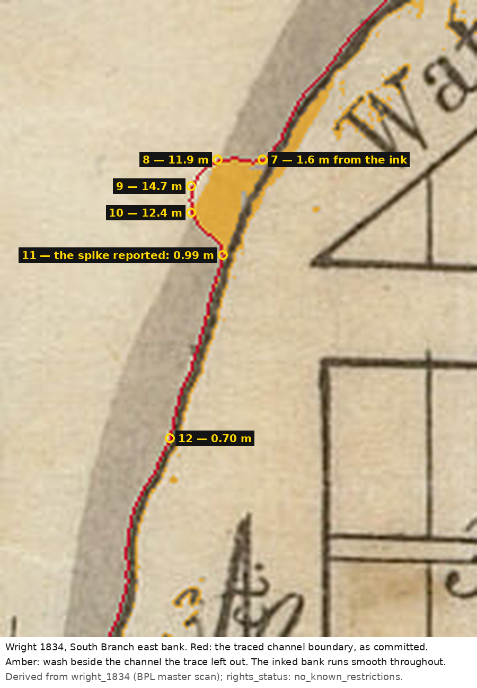

# The bump on the South Branch — it is not where it was reported to be

**Investigated:** 2026-09-04 · **Ticket:** T-0684 (T-0453 piece 1) · **Epoch:**
`e1834_harbor_cut` · **Feature:** `river.geojson` *South Division shore* · **Reach:**
local E +73 … +98, N −70 … −147 · **Sheet:** `wright_1834` (BPL master scan, IIIF region
868,1252,1120,1120) · **Tools:** `tools/trace_river.py`, `tools/measure_water_outliers.py`

The owner marked a bump on the South Branch's east bank that "sticks out" and should not be
there, and T-0453 measured it: the vertex at local **(87.2, −96.8)** stands **9.37 m** off the
straight line between its own two neighbours, the largest such departure in that feature. The
ticket asked for it to be resolved against the source and not deleted for looking wrong, and
for the same scan to be run over every other water feature so this one is not fixed while its
siblings survive.

Both were done, and the answer is not either of the two the ticket offered. **The marked
vertex is standing on the bank Wright drew. Its three neighbours to the north are the ones
that are not.**

## 1. The committed geometry is the trace's own output

`python3 tools/trace_river.py --check` re-fetched the Wright region — sha256
`3eae241663a2f252…`, 1120 × 1120 px, affine refit from 8 GCPs at RMS 17.5 m — and reproduced
`data/terrain/epochs/e1834_harbor_cut/river.geojson` **byte for byte**. So nothing here is a
hand edit that slipped past the "do not hand-edit" banner; the bump is what the trace
produces from the sheet, and the question is what the trace was reading.

*(The same run reports `DIFF` on `hydrology.geojson`. Geometry is identical to the millimetre;
two confidence strings differ from what the generator now writes. That is a separate defect
and it has its own ticket — nothing in this memo depends on it.)*

## 2. Departure from neighbours is a relative measure, and it misdirects here

`tools/measure_water_outliers.py` walks every vertex of every water feature of the epoch and
reports its perpendicular departure from the chord of its own two neighbours, together with
the length of that chord — because a large departure over a **long** chord is a bend in a
river, and a large departure over a **short** chord is a spike.

    departure    chord  feature                     idx  local ENU
      11.43 m  114.3 m  west_division_shore          11  (   -93.6,      0.2)
      11.09 m  100.9 m  north_division_shore          9  (   -35.9,     46.4)
      10.60 m   74.0 m  north_shore_harbor_reach      6  (   470.8,    101.8)
       9.45 m  136.4 m  north_shore_harbor_reach     20  (   986.7,    249.4)
       9.37 m   61.9 m  south_division_shore         11  (    87.2,    -96.8)
       9.29 m   94.3 m  south_shore_harbor_reach     54  (  1175.2,    265.6)
       8.23 m   48.1 m  south_division_shore          7  (    97.5,    -70.5)

Two things follow immediately. The marked vertex is **fifth**, not first: two vertices on
other banks depart their neighbours by more than it does. And the first of those, `west_
division_shore` 11, is 0.70 m from inked bank — a real bend in a real river, drawn as one.

Nothing on any drawn edge in the epoch exceeds the **±20 m** planform tolerance the dataset
declares for anything traced off the 1834 sheets (`data/traces/README.md`; `river.geojson`
states its own planform is "as drafted on a cadastral plat, not a hydrographic survey"). The
listing threshold in the tool is 5 m and it is a threshold about **shape**, not about
tolerance. The ticket asked for the sibling scan and this is its result: **no water vertex in
this epoch is out of tolerance.**

## 3. Distance to the inked bank is the absolute measure, and it settles it

The tool's `--vs-ink` mode carries every bank vertex back onto the scan through the same
affine the trace and the datum share, and measures it to the nearest inked pixel — the line
Wright actually drew, as against the grey wash beside it.

    69 bank vertices inside the window: median 0.70 m from inked bank, p90 4.56 m, max 14.73 m

    south_division_shore   9  (  78.7,  −78.1)   14.73 m from ink   3.12 m from wash
    south_division_shore  10  (  78.7,  −85.3)   12.38 m            0.00 m
    south_division_shore   8  (  85.6,  −70.7)   11.87 m            0.00 m
    north_division_shore  18  ( 165.5,  116.5)    6.88 m            0.70 m
    west_division_shore   21  (−190.8,  375.8)    5.04 m            0.70 m
    …
    south_division_shore  11  (  87.2,  −96.8)    0.99 m            0.00 m   <- the reported bump

Sixty-six of the sixty-nine bank vertices are within 5 m of inked bank and the median is one
map pixel. **The marked vertex 11 is 0.99 m from the ink.** Vertices 8, 9 and 10 — the three
immediately north of it, which the neighbour test reads as unremarkable because they are
displaced *together* — stand 11.9, 12.4 and 14.7 m off it. The 9.37 m "spike" is not a vertex
stepping out; it is the trace coming **back** to the bank after a 30-metre excursion away
from it.

## 4. Wright's bank does not step out and back

The acceptance question is about the drawn line, so it is asked of the drawn line.
`--bank-profile` walks the reach row by row and reports the westernmost inked pixel in a band
that contains the South Branch's east bank and no other ink (the platted lot lines east of it
begin at column 780; the channel west of it carries no ink at all).

    221 rows read, x from 747 to 649; 3 single-row reversals, largest 2 px; 0 of more than 2 px

Two hundred and twenty-one consecutive rows, and the bank walks west without ever turning
back by more than two pixels — 1.4 m, one and a half times the map's own 0.70 m pixel. A bank
that stepped out and back would show a sustained reversal across many rows. There is none.
**The bump is not in the source.**

## 5. What the trace was actually reading

Red is the traced channel boundary as committed; amber is wash that lies beside the channel
and was not taken into it. Everywhere on this reach the amber is a hairline — the trace
reaches the ink. Between vertices 7 and 11 it opens into a wedge about 20 px (14 m) across,
and the traced boundary runs down the far side of it.

`--lobe-map` prints the same thing as the trace's own four-way classification, and it is where
the mechanism is visible:

    W traced water · w wash NOT taken into the channel · I inked bank · . dry

     658 WWWWWWWWWWWWWWWWWWWWWWWWWWWWWWWWWWWWWWWWWWWWWWWWWWWW.II.wwww.....
     662 WWWWWWWWWWWWWWWWWWWWWWWWWWWWWW.wwwwwwwwwwwwwww.....IIIwwww.......
     666 WWWWWWWWWWWWWWWWWWWWWWWWW....wwwwwwwwwwwwwwwwwww.IIIwwww.........
     670 WWWWWWWWWWWWWWWWWWWWWWW....wwwwwwwwwwwwwwwwwwwIIIww..............
     680 WWWWWWWWWWWWWWWWWWWWWWWwwwwwwwwwwwwwwwww.IIIIw...................
     690 WWWWWWWWWWWWWWWWWWWWWWWWWWWWWWWWwwwwwIIIIw.......................
     700 WWWWWWWWWWWWWWWWWWWWWWWWWWWWWWWWWWIIIw...........................

Wright's wash is continuous to the ink through the whole reach — over all 221 rows of the reach the gap
from the inked bank to the nearest washed pixel has a median of 0.70 m — one map pixel — and a
worst case of **2.10 m**.
What appears at rows 662 to 690, and nowhere else on this bank, is a thin **dry seam inside
the wash**, three to six pixels wide, running parallel to the bank a little west of it. The
strip of wash east of that seam is separated from the channel body, the trace's morphology
does not recover it, and the boundary walks the seam instead of the bank. 645 px of wash in
this window stand outside the traced channel.

This is the same family of fault as the Clark Street bulge (`clark_reach_bulge_1834.md`),
where an outline capital and a foxing stain made a dry region continuous with the bank and the
boundary walk went round all three. It is much smaller — 14 m against 60 m — and it is a seam
rather than a letter, but the shape of the error is identical: **the trace is reading the
wash, and where the wash is interrupted the wash wins over the ink.**

## 6. What was NOT done, and why

T-0453 acceptance 4 governs this ticket: **nothing moves.** A vertex is not deleted because it
looks wrong, and this one is not wrong at all. Nor is the trace re-parameterised here: the
repair is a change to `tools/trace_river.py` that would re-derive the whole ring, and moving
the bank re-derives every waterline test in the project — `generate_plat_lots.py`'s headroom
check, the wet-sample refusals, the frontage works. That is its own unit of work with its own
count of changed records, and it now has its own ticket, with this measurement in front of it
so the next run does not have to find the seam again.

The reading recorded here is the reading: `river.geojson` is inside its own declared tolerance
everywhere, the bank Wright drew is smooth where the bump appears, and the 14.7 m the trace is
actually off by is three vertices north of where it was reported.

## 7. Reproducing this

    pip install numpy scipy Pillow pyproj
    python3 tools/trace_river.py --check          # fetches the region; reproduces river.geojson
    python3 tools/measure_water_outliers.py --vs-ink --bank-profile --lobe-map
