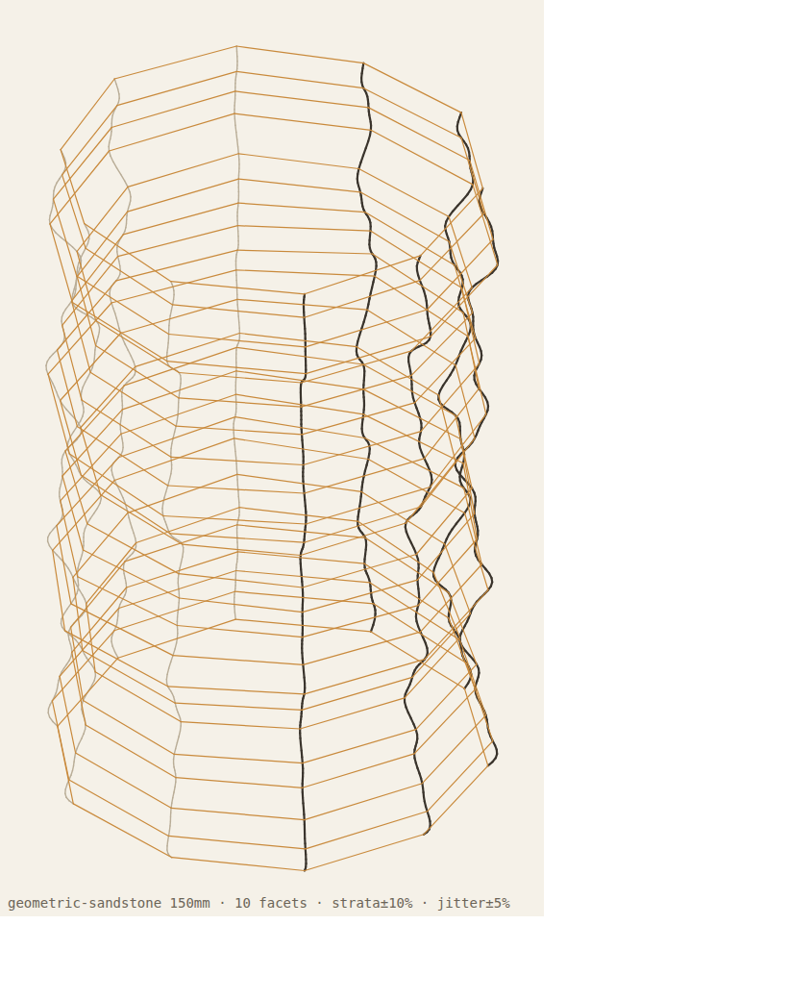

# Geometric Sandstone Lamp

A geometric cousin of the [Ordovician Sandstone](../ordovician-sandstone) lamp.
Same idea — strata layers stacked up a roughly cylindrical body whose radius
swells and pinches to give an organic "sandstone motion" — but rendered with
**straight, jagged, faceted walls** instead of smooth curves. Drops onto the
same standard 80 mm lamp-connect base.



*(Isometric wireframe schematic — vertical lines are the faceted corner edges,
horizontal lines are the strata. The printed object reads as flat panels
meeting at sharp corners. Open the `.stl`/`.scad` in a slicer/OpenSCAD for a
solid view.)*

## How it relates to Ordovician Sandstone

| | Ordovician (original) | Geometric (this project) |
|---|---|---|
| Cross-section | Smooth 120-point circle | Faceted polygon (default 10 sides) |
| Walls | Curved | **Straight flat panels, sharp corners** |
| Strata source | Parses a hand-sculpted mesh, interpolates | **Fully procedural** (sine bands + value noise) |
| Vertical edges | Smooth | **Jagged** — per-corner jitter drifts up the height |
| Base fit | wall 2 / base 9.46 / hole 66 | Same — seats on the standard base |

The "motion" is preserved (the radius profile flows up the height just like
sandstone strata); only the *rendering* is angular.

## Approach

- **Faceted cross-section.** Each layer is an N-gon. Walls are drawn as
  straight chords between corners, so every facet is a flat panel.
- **Flat panels + round holes at once.** Each ring carries `facets × subdiv`
  points; the points between two corners are interpolated *along the straight
  corner-to-corner chord*. Walls stay perfectly flat, while the base disc and
  centre hole stay high-resolution and round.
- **Procedural strata "motion".** The exterior radius is
  `mean_radius × (1 + strata_amp · f(t))` where `f(t)` is a sum of sine bands
  (≈3.5 / 7 / 13 cycles over the height) plus slow value noise — the swelling
  and pinching that reads as sandstone strata.
- **Jagged angles.** Each corner gets an independent radial jitter that drifts
  slowly up the height, so the polygon is irregular and the vertical wall lines
  zig-zag while still following the overall flow.
- **Manifold mesh.** Outer faceted shell + inner faceted shell (offset inward)
  + solid base disc with a clean cylindrical centre hole. The radial
  cross-section closes cleanly (no lip reusing wall edges), so the STL is fully
  watertight (verified 0 non-manifold edges).

## Directory Structure

```
geometric-sandstone/
├── main/
│   ├── generate_geometric_sandstone.py   # Parametric generator (.scad + .stl)
│   └── preview_svg.py                     # Dependency-free wireframe preview
├── files/
│   └── lamp/                              # Generated print-ready files
└── previews/                              # Wireframe schematics (.svg / .png)
```

## Usage

```bash
cd geometric-sandstone/main

# Default — 150mm, 10 facets, fits the standard base (wall2, base9.46, hole66)
python3 generate_geometric_sandstone.py

# Chunkier crystal (7 facets), taller
python3 generate_geometric_sandstone.py --facets 7 --height 180

# More jagged / irregular angles
python3 generate_geometric_sandstone.py --facet-jitter 0.10 --strata-amp 0.14

# Spiral the facets up the height for diagonal ridges
python3 generate_geometric_sandstone.py --twist 25

# Different random rock
python3 generate_geometric_sandstone.py --seed 7

# Solid display object (no bore)
python3 generate_geometric_sandstone.py --solid

# Quick wireframe preview (matches the same parameters)
python3 preview_svg.py --facets 7 -o preview.svg
```

### Parameters

| Flag | Description | Default |
|------|-------------|---------|
| `--height` | Target height in mm | 150 |
| `--facets` | Polygon sides per cross-section | 10 |
| `--layers` | Strata layer count | scales with height (~139 @ 150 mm) |
| `--subdiv` | Mesh points per facet edge (flat walls, round caps) | 8 |
| `--radius` | Mean exterior radius in mm (≈90 mm dia) | 45 |
| `--strata-amp` | Strata radial swell, fraction of radius | 0.10 |
| `--facet-jitter` | Per-corner jaggedness, fraction of radius | 0.05 |
| `--taper` | Top narrowing over full height, fraction | 0.0 |
| `--twist` | Total facet rotation over the height, degrees | 0 |
| `--seed` | Random seed for the procedural rock | 42 |
| `--wall` | Wall thickness in mm | 2.0 |
| `--base` | Solid base height in mm | 9.46 |
| `--base-hole` | Centre hole diameter in mm | 66.0 |
| `--solid` | Solid model (no hollow/base/hole) | *(off)* |
| `-o` | Output basename | *(auto)* |

## Pre-Generated

`files/lamp/` includes the default print:

- **`geometric_sandstone_150mm_10fac_139L_wall2_base9.46_hole66`** — 150 mm
  tall, 10 facets, ~96 mm diameter, hollow 2 mm wall, 9.46 mm solid base,
  66 mm centre hole. Fully manifold. Seats on the standard 80 mm lamp-connect
  base (see `../ordovician-sandstone/files/connect/`).

## Tools

- Python 3 (no external dependencies)
- [OpenSCAD](https://openscad.org/) (for viewing/editing `.scad`)
