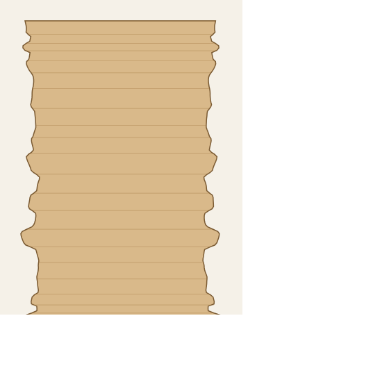
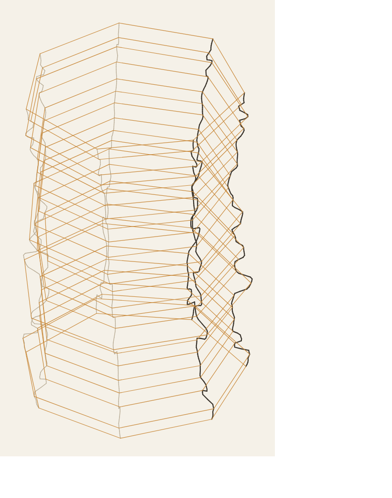

# Geometric Sandstone Lamp

A geometric cousin of the [Ordovician Sandstone](../ordovician-sandstone) lamp.
Same idea — stacked strata layers up a roughly cylindrical body, with the same
swelling/pinching "sandstone motion" and the same **merging, blending ledges** —
but rendered with **straight, jagged, faceted walls** instead of smooth curves.
Seats on the same standard 80 mm lamp-connect base.

Side elevation (strata bands) | Isometric (facets)
:---:|:---:
 | 

*(Schematics. The side view shows the stacked strata shelves that merge/blend;
the iso view shows the faceted, twisting corner edges. Open the `.stl`/`.scad`
for a solid view.)*

## How it relates to Ordovician Sandstone

| | Ordovician (original) | Geometric (this project) |
|---|---|---|
| Cross-section | Smooth 120-point circle | Faceted polygon (default 7 sides) |
| Walls | Curved | **Straight flat panels, sharp corners** |
| Strata source | Parses a hand-sculpted mesh | **Fully procedural** (bands + sine + noise) |
| Layer blending | Smooth interpolation | **`band_blend` knob** — hard ledges → fully merged |
| Vertical edges | Smooth | **Jagged** — per-corner jitter + twist |
| Base fit | wall 2 / base 9.46 / hole 66 | Same — seats on the standard base |

The "motion" *and* the stacked-strata banding are both preserved; only the
*rendering* is angular.

## Approach

- **Stacked strata bands.** The body is divided into `strata_bands` sediment
  shelves of uneven thickness, each at its own radius. `band_blend` controls
  how the shelves transition: **0 = hard stepped ledges** (distinct layers),
  **1 = layers fully merge and blend** into smooth flowing strata. This is what
  gives the real sandstone "layers merging" look.
- **Faceted cross-section.** Each layer is an N-gon drawn with straight chords,
  so every facet is a flat panel meeting its neighbours at sharp corners.
- **Flat panels + round holes at once.** Each ring carries `facets × subdiv`
  points interpolated *along* the straight corner-to-corner chord — walls stay
  perfectly flat while the base disc and centre hole stay high-res and round.
- **Jagged angles.** Per-corner radial jitter (drifting up the height) plus an
  overall `twist` make the polygon irregular and the wall lines zig-zag/spiral
  while still following the strata flow.
- **Manifold mesh.** Outer faceted shell + inner faceted shell (offset inward)
  + solid base disc with a clean cylindrical centre hole; the radial
  cross-section closes cleanly. Every generated STL is verified watertight
  (0 non-manifold edges).

## Two ways to use it

1. **`geometric_sandstone_lamp.scad`** — a native, fully parametric OpenSCAD
   model. Open it, hit *Window ▸ Customizer*, and drag sliders for facets,
   bands, blend, twist, jitter, wall/base/hole, seed — live. Best for tuning.
2. **`generate_geometric_sandstone.py`** — bakes a print-ready `.scad` + `.stl`
   with the identical math (and high-res round caps/holes). Best for exporting.

## Directory Structure

```
geometric-sandstone/
├── main/
│   ├── geometric_sandstone_lamp.scad     # Live-tunable OpenSCAD Customizer model
│   ├── generate_geometric_sandstone.py   # Baked .scad + .stl exporter
│   └── preview_svg.py                     # Dependency-free side/iso previews
├── files/
│   └── lamp/
│       ├── geometric_sandstone_default.*  # Default 150mm print
│       └── variations/                    # More faces / more twist
└── previews/                              # Schematics (.svg / .png)
```

## Usage

```bash
cd geometric-sandstone/main

# Default — 150mm, 7 facets, banded strata, fits the standard base
python3 generate_geometric_sandstone.py

# Hard stacked ledges (distinct layers) vs fully merged layers
python3 generate_geometric_sandstone.py --band-blend 0.08
python3 generate_geometric_sandstone.py --band-blend 0.85

# More faces + more twist
python3 generate_geometric_sandstone.py --facets 16 --twist 45

# Coarser / finer sediment banding
python3 generate_geometric_sandstone.py --strata-bands 12 --band-amp 0.10

# Different random rock
python3 generate_geometric_sandstone.py --seed 7

# Preview (side = strata, iso = facets) — matches the same parameters
python3 preview_svg.py --view side --facets 16 --twist 45 -o preview.svg
```

### Parameters

| Flag | Description | Default |
|------|-------------|---------|
| `--height` | Target height in mm | 150 |
| `--facets` | Polygon sides per cross-section | 7 |
| `--layers` | Strata layer count | scales w/ height (~139 @ 150 mm) |
| `--subdiv` | Mesh points per facet edge (flat walls, round caps) | 8 |
| `--radius` | Mean exterior radius in mm (≈90 mm dia) | 45 |
| `--strata-bands` | Number of stacked sediment shelves | 22 |
| `--band-amp` | Shelf depth, fraction of radius | 0.07 |
| `--band-blend` | 0 = hard ledges, 1 = fully merged layers | 0.40 |
| `--strata-amp` | Smooth swell layered over bands, fraction | 0.05 |
| `--facet-jitter` | Per-corner jaggedness, fraction of radius | 0.05 |
| `--taper` | Top narrowing over full height, fraction | 0.0 |
| `--twist` | Total facet rotation over the height, degrees | 12 |
| `--seed` | Random seed for the procedural rock | 42 |
| `--wall` | Wall thickness in mm | 2.0 |
| `--base` | Solid base height in mm | 9.46 |
| `--base-hole` | Centre hole diameter in mm | 66.0 |
| `--solid` | Solid model (no hollow/base/hole) | *(off)* |
| `-o` | Output basename | *(auto)* |

## Pre-Generated

- **`files/lamp/geometric_sandstone_default`** — 150 mm, 7 facets, banded
  strata, ~96 mm dia, hollow 2 mm wall, 9.46 mm solid base, 66 mm centre hole.
  Fully manifold. Seats on the standard 80 mm lamp-connect base (see
  `../ordovician-sandstone/files/connect/`).
- **`files/lamp/variations/`** — `12fac_twist30`, `16fac_twist45`,
  `10fac_twist60`, `20fac_twist90`.

## Base attachment

The standard connector is the **80 mm "twisted puck"** (`../ordovician-sandstone/
files/connect/`): a ~66 mm diameter body, ~9.5 mm tall, with 80 mm flanges top
and bottom. The lamp's 66 mm base hole + 9.46 mm solid base match that interface
(same as the original lamp). A positive screw/twist-lock attachment on the
bottom is a planned addition — see project notes.

## Tools

- Python 3 (no external dependencies)
- [OpenSCAD](https://openscad.org/) (for the live Customizer model)
