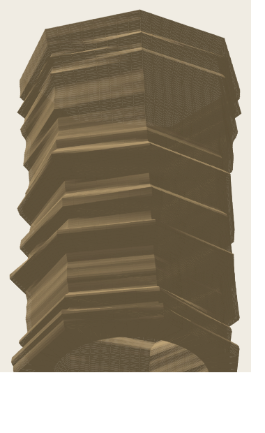
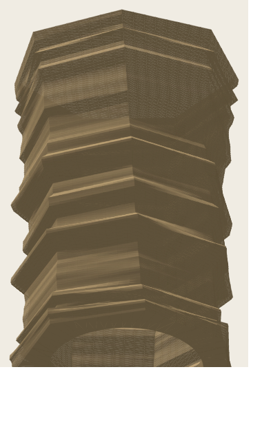

# Geometric Sandstone Lamp

A geometric cousin of the [Ordovician Sandstone](../ordovician-sandstone) lamp.
Same idea — stacked strata layers up a roughly cylindrical body, with the same
swelling/pinching "sandstone motion" and the same **merging, blending ledges** —
but rendered with **straight, jagged, faceted walls** instead of smooth curves.
Seats on the same standard 80 mm lamp-connect base.

 

*(Shaded renders of the default. Angular stacked shelves with slope-limited,
support-free overhangs. See `files/lamp/angular/` for the irregular set.)*

## How it relates to Ordovician Sandstone

| | Ordovician (original) | Geometric (this project) |
|---|---|---|
| Cross-section | Smooth 120-point circle | Faceted polygon (default 7 sides) |
| Walls | Curved | **Straight flat panels, sharp corners** |
| Strata source | Parses a hand-sculpted mesh | **Fully procedural** (bands + warp + noise) |
| Strata shape | Smooth bands | **Angular shelves** that tilt, merge AND split |
| Polygon | n/a | **Irregular** side widths, optional |
| Vertical edges | Smooth | **Jagged** — jitter + twist + per-corner wander |
| Printability | — | **Overhangs clamped** to a support-free angle |
| Base fit | wall 2 / base 9.46 / hole 66 | Same — seats on the standard base |

## Approach

- **Angular strata shelves.** The body is divided into `strata_bands` sediment
  shelves of uneven thickness, each at its own radius, joined by **straight
  linear ramps** (not rounded S-curves) so the silhouette is angular with sharp
  vertices. `band_blend` sets ramp width: **0 = hard ledges**, **1 = long
  merged ramps**.
- **Merging *and* splitting layers.** `band_warp` tilts the strata as a smooth
  function of angle, so a shelf pinches out (splits) on one side and converges
  (merges) with its neighbour on another — the real-sandstone look, instead of
  perfectly horizontal rings.
- **Irregular faceting.** `angle_irregular` gives the polygon uneven side
  widths (some alike, none forced equal); `twist` spins the section uniformly
  and `twist_wander` adds a per-corner irregular spiral that grows up the
  height, so each vertical edge wanders.
- **Printable overhangs.** `overhang_limit` clamps how fast the radius may grow
  upward, capping every downward-facing chamfer to a support-free angle
  (default 45° from vertical) — ~6× fewer steep overhangs than rounded bulges.
- **Flat panels + round holes at once.** Each ring carries `facets × subdiv`
  points interpolated *along* the straight corner-to-corner chord — walls stay
  flat while the base disc and centre hole stay high-res and round.
- **Manifold mesh.** Outer shell + inner shell (offset inward) + solid base
  disc with a clean cylindrical centre hole. Every generated STL is verified
  watertight (0 non-manifold edges).

## Two ways to use it

1. **`geometric_sandstone_lamp.scad`** — a native, fully parametric OpenSCAD
   model. Open it, hit *Window ▸ Customizer*, and drag sliders for facets,
   bands, blend, twist, jitter, wall/base/hole, seed — live. Best for tuning.
2. **`generate_geometric_sandstone.py`** — bakes a print-ready `.scad` + `.stl`
   with the identical math (and high-res round caps/holes). Best for exporting.

## Directory Structure

```
geometric-sandstone/
├── main/
│   ├── geometric_sandstone_lamp.scad     # Live-tunable OpenSCAD Customizer model
│   ├── generate_geometric_sandstone.py   # Baked .scad + .stl exporter
│   ├── attach_base.py                     # Fuse the twist-lock puck onto a shade
│   ├── render_stl.py                      # Shaded STL preview (SVG)
│   └── preview_svg.py                     # Quick wireframe/side schematic
├── files/
│   └── lamp/
│       ├── geometric_sandstone_default.*  # Default 150mm print (shade only)
│       ├── variations/                    # More / fewer facets, more twist
│       ├── angular/                        # Irregular + wandering + merge/split set
│       │   └── with_base/                  #   …each fused with the twist-lock puck
│       └── with_base/                     # Default + variations fused with the puck
└── previews/                              # Shaded renders (.svg / .png)
```

## Usage

```bash
cd geometric-sandstone/main

# Default — 150mm, 7 facets, angular printable strata, fits the standard base
python3 generate_geometric_sandstone.py

# The irregular / wandering / merge-split character (the "angular" set)
python3 generate_geometric_sandstone.py --facets 6 --twist 40 \
        --angle-irregular 0.5 --twist-wander 10 --band-warp 0.08

# Hard stacked ledges vs long merged ramps
python3 generate_geometric_sandstone.py --band-blend 0.05
python3 generate_geometric_sandstone.py --band-blend 0.9

# Looser overhang cap (steeper, may need supports) or stricter
python3 generate_geometric_sandstone.py --overhang-limit 60
python3 generate_geometric_sandstone.py --overhang-limit 35

# Shaded preview of whatever you exported
python3 render_stl.py mylamp.stl -o mylamp.svg --az 22 --el 58
```

### Parameters

| Flag | Description | Default |
|------|-------------|---------|
| `--height` | Target height in mm | 150 |
| `--facets` | Polygon sides per cross-section | 7 |
| `--layers` | Strata layer count | scales w/ height (~139 @ 150 mm) |
| `--subdiv` | Mesh points per facet edge (flat walls, round caps) | 8 |
| `--radius` | Mean exterior radius in mm (≈90 mm dia) | 45 |
| `--strata-bands` | Number of stacked sediment shelves | 22 |
| `--band-amp` | Shelf depth, fraction of radius | 0.07 |
| `--band-blend` | Ramp width: 0 = hard ledges, 1 = long merged ramps | 0.35 |
| `--band-warp` | Tilt strata so layers merge **and** split | 0.06 |
| `--strata-amp` | Smooth (curvy) swell — keep low for angular | 0.03 |
| `--facet-jitter` | Per-corner jaggedness, fraction of radius | 0.05 |
| `--angle-irregular` | Uneven side widths, 0..0.85 (0 = regular) | 0.0 |
| `--twist` | Uniform facet rotation over the height, degrees | 12 |
| `--twist-wander` | Per-corner irregular spiral, degrees of swing | 0.0 |
| `--overhang-limit` | Cap overhang from vertical, support-free (0 = off) | 45 |
| `--taper` | Top narrowing over full height, fraction | 0.0 |
| `--seed` | Random seed for the procedural rock | 42 |
| `--wall` | Wall thickness in mm | 2.0 |
| `--base` | Solid base height in mm | 9.46 |
| `--base-hole` | Centre hole diameter in mm | 66.0 |
| `--solid` | Solid model (no hollow/base/hole) | *(off)* |
| `-o` | Output basename | *(auto)* |

## Pre-Generated

- **`files/lamp/geometric_sandstone_default`** — 150 mm, 7 facets, angular
  printable strata, ~96 mm dia, hollow 2 mm wall, 9.46 mm base, 66 mm bore.
  Seats on the standard 80 mm lamp-connect base.
- **`files/lamp/variations/`** — `12fac_twist30`, `16fac_twist45`,
  `10fac_twist60`, `20fac_twist90` (regular polygons, varied twist).
- **`files/lamp/angular/`** — the irregular set: `5sides_twist25`,
  `6sides_twist40`, `9sides_twist12`, `11sides_twist60`, `13sides_twist0`,
  each with irregular sides, wandering edges, and merging/splitting strata.
- Every shade has a `…_with_base` twin (puck fused on) under `with_base/`.

## Base attachment (twist-lock for the Bambu LED module)

The lamp uses the project's existing **80 mm "twisted puck"** twist-lock
receiver (`../ordovician-sandstone/files/connect/…twisted_puck.stl`): a 9.46 mm
disc with a ⌀66 body / ⌀80 flange and a ⌀63 internal bore with twist-lock tabs.
The Bambu LED module drops into that bore from below and twists ~30° to lock —
the same connector the original sandstone lamp uses (see its
`…-to80mmtwistedpuck` files).

The shade is generated with a matching 9.46 mm solid base and ⌀66 bore, so the
puck nests into the bottom with **zero alignment** (both centred, both flush at
z0). `attach_base.py` fuses the two into one print-ready, multi-body STL — the
slicer unions the overlapping solids, exactly like the original:

```bash
# Generate a shade, then fuse the twist-lock puck onto its base
python3 generate_geometric_sandstone.py -o mylamp
python3 attach_base.py mylamp.stl -o mylamp_with_base.stl
```

Pre-fused files are in **`files/lamp/with_base/`** (default + all variations).
The standalone shades in `files/lamp/` print without the connector if you'd
rather drop a separately-printed puck in. Use `attach_base.py --dz/--rotate`
or `--connector` to align a different puck.

## Tools

- Python 3 (no external dependencies)
- [OpenSCAD](https://openscad.org/) (for the live Customizer model)
