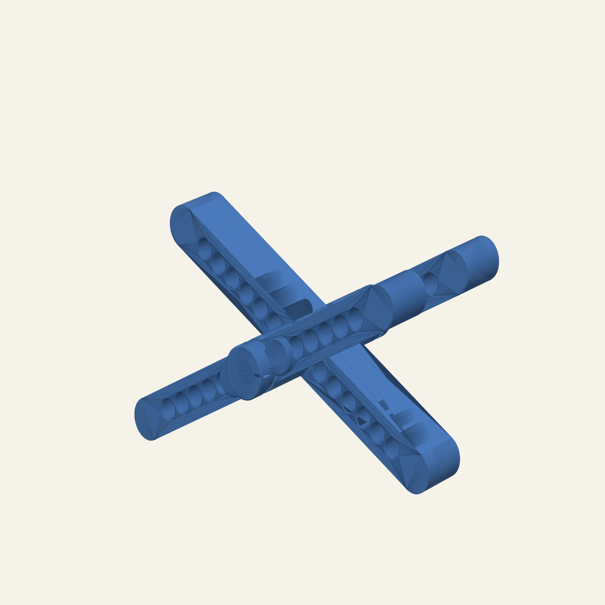

# Stand

A parametric, three-rail display stand based on the foam prototype in the
reference photos. It is sized for an irregular object of approximately
150 × 120 mm and up to 1 kg.



All three rails are identical. They rotate independently around one removable
axle. Four removable stop pins—two at each outer/centre rail interface—bracket
the selected angle. Moving each pin pair to the next mirrored holes changes the
angle while keeping the assembly mechanically locked in both directions.

## Included parts

| File | Print quantity | Purpose |
|---|---:|---|
| `files/stand_rail.stl` | 3 | Universal 180 × 26 mm rail |
| `files/stand_axle.stl` | 1 | 12 mm common axle with permanent head |
| `files/stand_cap.stl` | 1 | Split, removable friction cap |
| `files/stand_spacer.stl` | 4 | 4 mm anti-bind washers |
| `files/stand_stop_pin.stl` | 4 | 8 mm angle-locking pins |
| `files/stand_fit_test.stl` | 1 first | Clearance test before the full print |
| `files/stand_rails_x3.stl` | 1 optional | All three rails on one build plate |
| `files/stand_hardware_set.stl` | 1 optional | Axle, cap, four pins and four spacers |

`stand.scad` is the editable source; the STL files are generated deliverables.

## Why it should carry 1 kg

The static load is only about 9.8 N. The default 12 mm axle and 8 mm stop pins
have large cross-sections for that load, even after allowing a several-times
handling factor. The pivot has a 22 mm reinforced boss and each loaded angle is
restrained by four pins rather than friction alone.

As a conservative check, treating the 60 mm outer-rail spacing as a simply
supported axle span gives approximately 0.87 MPa nominal bending stress in the
12 mm axle. Applying a 4× handling factor raises that to about 3.5 MPa. A single
8 mm pin taking the entire load across a 10 mm cantilever would see roughly
2 MPa nominal bending stress, or about 8 MPa at 4×. Those values are comfortably
below typical well-printed PLA strength, but the completed print still needs a
real load test because layer adhesion and print defects vary.

The practical limits are long-term PLA creep, poor layer bonding, and tipping
from an off-centre object. This is a display stand, not certified lifting or
safety equipment. Keep the object's centre of mass inside the roughly 94 mm
axial footprint and do not use it overhead or where a fall could cause injury.
For a valuable or frequently handled object, a 12 mm metal or hardwood axle is
an easy upgrade.

## Assembly

From the fixed axle head, install:

1. spacer;
2. outer rail;
3. spacer;
4. centre rail, rotated the opposite direction;
5. spacer;
6. outer rail, parallel to the first;
7. spacer;
8. removable cap.

Use matching holes on both sides of the pivot. Insert two pins from the outside
of the first outer rail toward the centre rail, then mirror that arrangement on
the other outer rail. The nearest pair of holes gives the steepest default
position (about 54° rail-to-rail); holes are spaced every 10 mm. Always use both
pins at each interface.

Add thin felt, cork, or TPU pads where the object touches the rails. They improve
grip and protect the object without changing the structural parts.

## AD5M Pro / PLA starting profile

- 0.20 mm layer height and 0.4 or 0.6 mm nozzle.
- Rails: 5 walls, 6 top/bottom layers, 35–45% gyroid or cubic infill.
- Axle and pins: 6 walls and 80–100% infill; print upright with a 6–8 mm brim.
- Rails, spacers and cap are already oriented with their critical holes vertical.
- Supports are not required.
- Print `stand_fit_test.stl` first. The 12 mm axle has 0.60 mm diametral
  clearance; the 8 mm pins have 0.50 mm. Adjust the two clearance parameters in
  `stand.scad` if your filament/printer combination is tighter or looser.

PLA is suitable indoors away from sustained heat. PETG is preferable near a
sunny window or for long-term loading because it is less likely to soften, though
it may flex more.

## Regenerating and resizing

Open `stand.scad` in OpenSCAD's Customizer, or run:

```bash
python3 build.py --preview
```

Parameters can be overridden without editing the source:

```bash
python3 build.py --define rail_length=200 --define rail_width=30
```

The primary sizing controls are `rail_length`, `rail_thickness`, `rail_width`,
`spacer_thickness`, `stop_hole_start`, `stop_hole_pitch`, and
`stop_hole_count`. `build.py` exports binary STLs and verifies that every mesh
is watertight before writing `files/manifest.json`.
